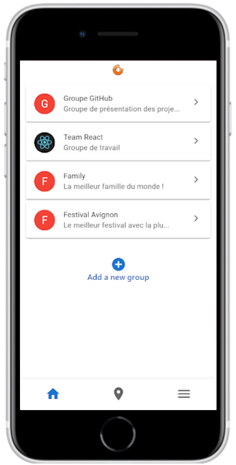
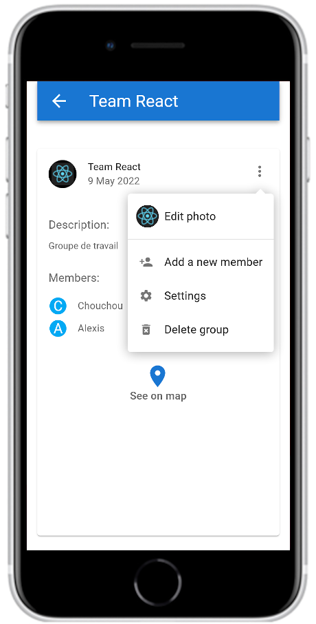
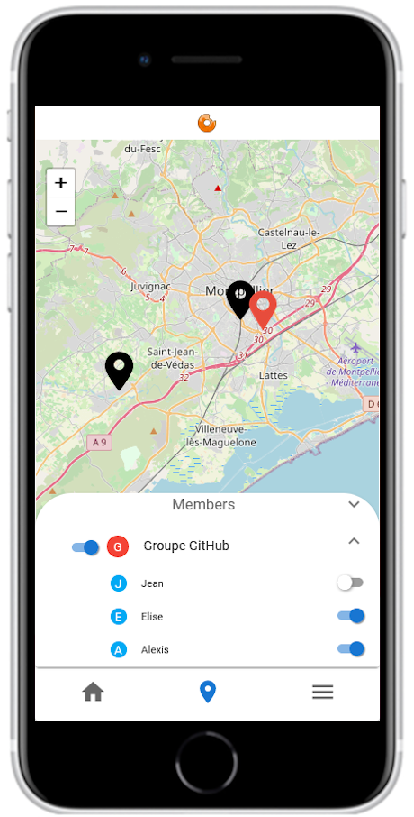
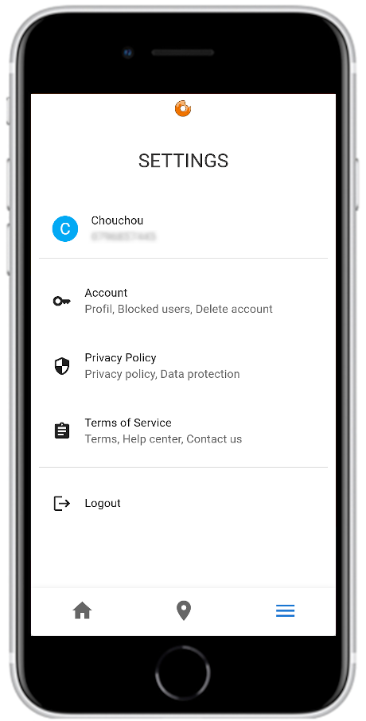

# Find-Us (Share your location with your group)

---

Une application qui permet de partager sa position GPS au sein d'un groupe (Whatsapp like).

 
 

---

## Objectives :

---

L'idée était de réaliser une application complète (back et front) afin de me familiariser avec le développement d'une application mobile. Cette première version a été réalisée sous React afin de simuler une application mobile. La V2 réalisera la migration sous React Native. 

L'application est un mixte entre un réseau social et un tracker GPS. Elle permet de : 

- Créer un groupe (ami, famille, travail) afin de partager sa position GPS en temps réel avec l'ensemble des membres.
- Afficher la position GPS des membres d'un groupe avec la possibilité de filtrer par membre.
- Et plein d'autres choses... 

## Technologies used :

---

Voici les technos principalement utilisées :

- Back : Fastify, SQL Server
- Front : React, Redux Toolkit, Leaflet, Mui

Si vous souhaitez démarrer l'application, il faudra faire tourner deux terminaux : 

- Pour la partie back, il suffit de taper la commande "npm start" (port 3000)
- Pour la partie front, il suffit de taper la commande "npm run start-front" (port 5501)